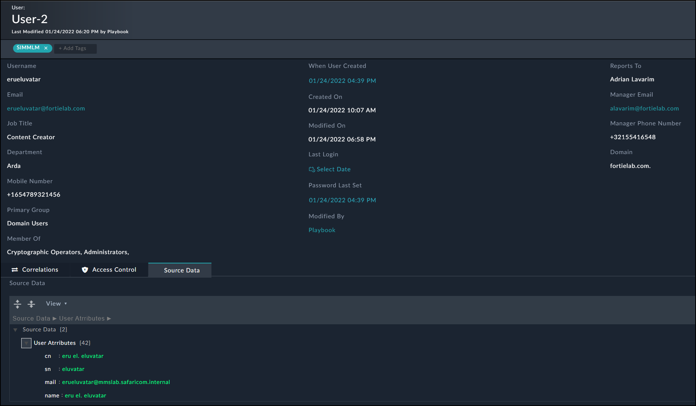

# Content Description:
- Additional fields for Users module:
    - Source Data
    - Primary Group
    - Manager Email
    - Email
    - When User Created
    - Reports To
    - Job Title
    - Mobile Number
    - Member Of
    - Department
    - Password Last Set
    - Manager Phone Number
- Enhanced View Template:

- Enrichment Playbook: Fetches several users attributes from Active Directory

# Deployment:

- Download the code zip from here (code then Download Zip file)
- Import the playbook collection via the import wizard. Browse to: **Settings -> Import Wizard** and click on **Import from file** selecting the zip file you just downloaded
- On user create the provided playbook will be triggered to perform the enrichment
